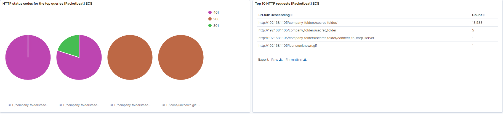

Identify the offensive traffic.

Identify the traffic between your machine and the web machine:

When did the interaction occur?

`The connection happened on 11-14 at 1:35am where the spike on the graph is interacting the Kali IP 192.168.1.90 and the Capstone IP 192.168.1.105 interacted.` 

What responses did the victim send back?

`What we found is that there were a lot of 401 error status code found at about 1:40am You can see the spikes in the charts that I have posted below.`

What data is concerning from the Blue Team perspective?

`Spikes in activity where the blue team can see data being transferred. Something worth investigating.` 

Find the request for the hidden directory.

In your attack, you found a secret folder. Let's look at that interaction between these two machines.

How many requests were made to this directory? At what time and from which IP address(es)?

`There were over 13,000 requests at 1:35am and they came from IP 192.168.1.105.`

Which files were requested? What information did they contain?
What kind of alarm would you set to detect this behavior in the future?

`The files were the connect_to_corp_server. This file contained information about a user named Ryan and with that we found the hash value. This is were we took the hash and used CrackStation to decrypt it and give us the password for Ryan linux4u.Email notification sent at a threshold of 20,000 requests in 5 minutes.`

Identify at least one way to harden the vulnerable machine that would mitigate this attack.

`Updating the services and setting security policy rules`

Identify the brute force attack.

After identifying the hidden directory, you used Hydra to brute-force the target server. Answer the following questions:

Can you identify packets specifically from Hydra?

`Hydra is a online dictionary attack tool. Brute force over the internet. John the ripper is off line tool`

How many requests were made in the brute-force attack?

`In the chart you can see it was 10,159`

How many requests had the attacker made before discovering the correct password in this one?

`Using the pie chart we can see that 13,532 were error code 401 and only one was a success.`

What kind of alarm would you set to detect this behavior in the future and at what threshold(s)?

`Email alert with a threshold of 0 because Hydra is pen-testing dictionary online tool`

Identify at least one way to harden the vulnerable machine that would mitigate this attack.

`Block Hydra and IP request hat request too many password failures.`

Find the WebDav connection.

Use your dashboard to answer the following questions:

How many requests were made to this directory?

`There 68 call requests for webdav as you can see on the charts below.`

Which file(s) were requested?

`The files I see being requested are the rockyou.txt and the reverseshell.php.`

What kind of alarm would you set to detect such access in the future?

`Create a alert or email to when ever any suspicious activity happens on the machine. Like too many log in tries and if someone gains access to the machine from somewhere else.`

Identify at least one way to harden the vulnerable machine that would mitigate this attack.

`This I will start out with employee training on how to handle unsolicited text files. I would make a rule that does not allow access to these files via the web browser.` 

Identify the reverse shell and meterpreter traffic.

To finish off the attack, you uploaded a PHP reverse shell and started a meterpreter shell session. Answer the following questions:

Can you identify traffic from the meterpreter session?

`From the picture below it looks like a lot of port 4444 is being used and as a SOC I would get to know that attackers use this ort a lot and forget to change it or disguise it.`

What kinds of alarms would you set to detect this behavior in the future?

`Getting near the ending so having a bit of fun here viewer discretion advisory.`

[Rambo!!!!!](https://youtu.be/4QSDwruOF4w)

Identify at least one way to harden the vulnerable machine that would mitigate this attack.

`Training staff to only allow privileged employees the ability to upload or down load any files.`